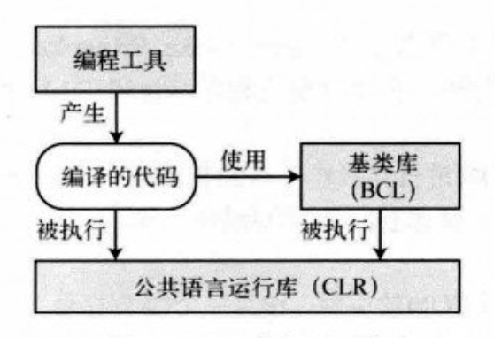

# 图解C#

> 入职前学习一下C#，希望初入职场的小白可以乘风破浪、勇往直前！

## C#和.NET框架

C#是为在微软的.NET框架上开发程序而设计的。

### .NET框架的组成

.NET框架由三部分组成：

执行环境为CLR（Common Language Runtime），CLR在运行时管理程序的执行：

- 内存管理，垃圾收集
- 代码安全验证
- 代码执行、线程管理及异常处理

BCL（Base Class Library）是.NET框架使用的一个大的类库，也可在自己的程序中使用。

**.NET框架**的特点：

1. **面向对象的开发环境。**CLR、BCL和C#都是面向对象的。
2. **自动垃圾收集。**CLR中有GC（Barbage Collector）能够自动管理内存。GC自动从内存中删除程序不再访问的对象。
3. **互操作性。**
   - 一种.NET语言写的程序可以使用甚至继承用另一种.NET语言写的类
   - 