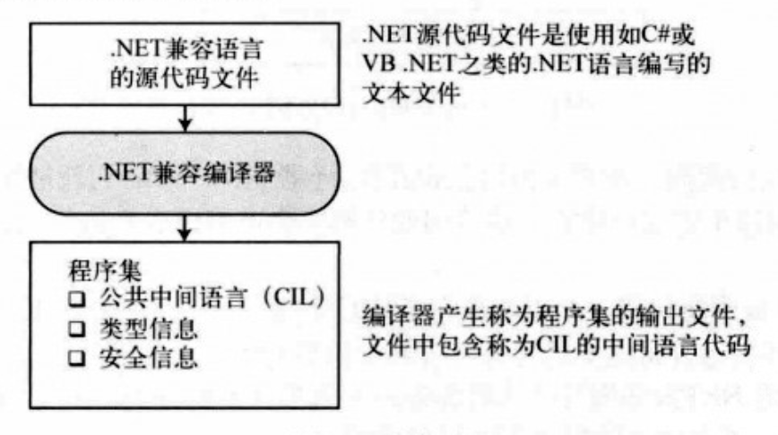
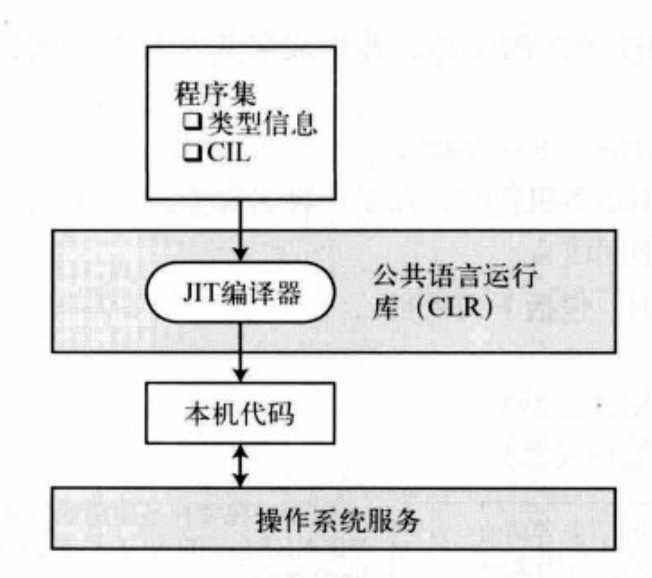
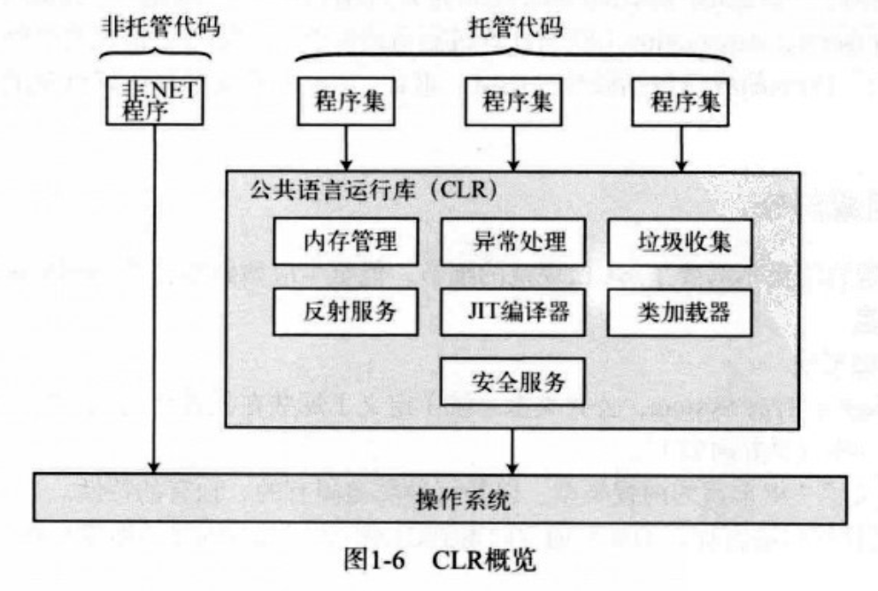
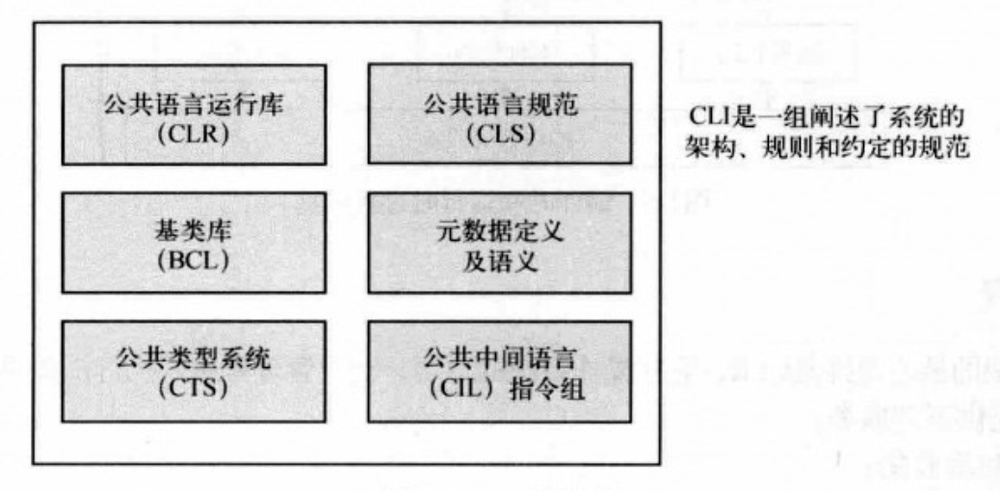
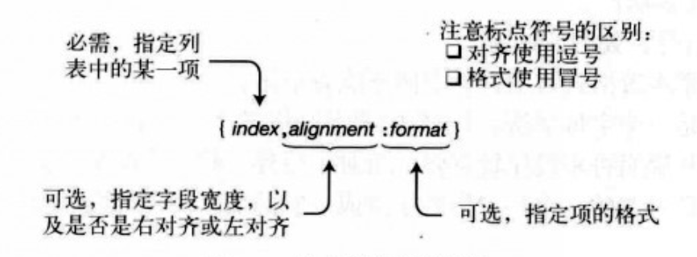
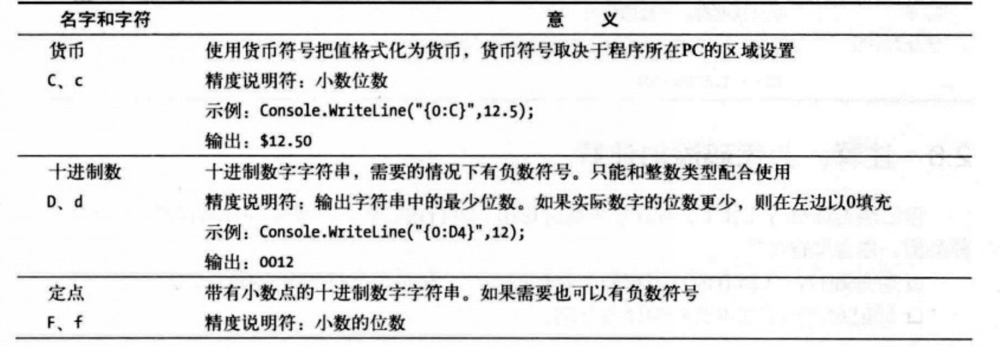
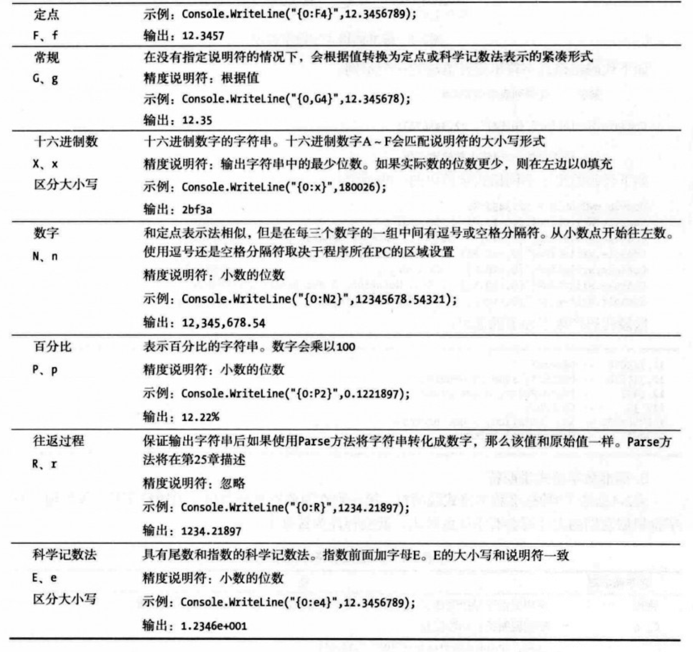
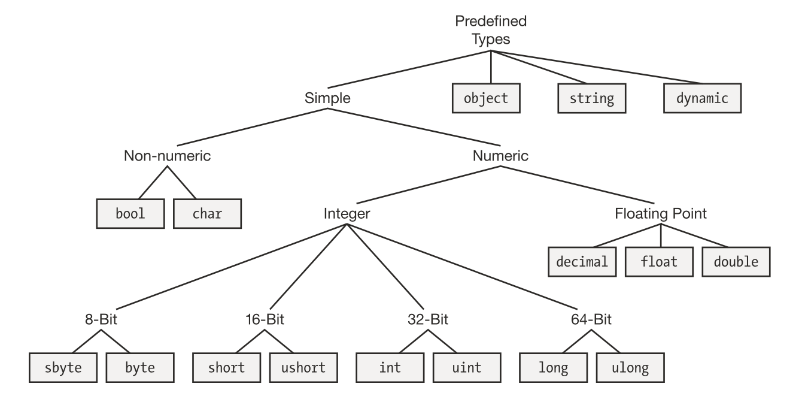
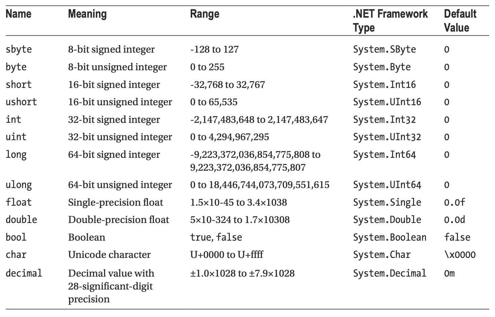

# 图解C#

> 入职前学习一下C#，希望初入职场的小白可以乘风破浪、勇往直前！

## C#和.NET框架

C#是为在微软的.NET框架上开发程序而设计的。

### .NET框架

#### .NET框架的组成

.NET框架由三部分组成：


执行环境为CLR（Common Language Runtime），CLR在运行时管理程序的执行：

- 内存管理，垃圾收集
- 代码安全验证
- 代码执行、线程管理及异常处理

BCL（Base Class Library）是.NET框架使用的一个大的类库，也可在自己的程序中使用。

#### .NET框架的特点

1. **面向对象的开发环境。** CLR、BCL和C#都是面向对象的。
2. **自动垃圾收集。** CLR中有GC（Barbage Collector）能够自动管理内存。GC自动从内存中删除程序不再访问的对象。
3. **互操作性**
   - 一种.NET语言写的程序可以使用甚至继承用另一种.NET语言写的类
   - .NET具有平台调用的特性，允许.NET的代码调用并使用非.NET的代码
   - .NET框架允许与COM（Component Object Model，组件对象模型）进行互操作
4. **不需要COM**
   - COM中所有对象必须实现IUnknown接口；**所有.NET对象都继承object类。**
   - COM中所有的类型信息作为`.tlb`文件保存在类型库中，和可执行代码是分开的；**.NET中程序的类型信息和代码一起保存在程序文件中。**
   - COM中程序员必须记录一个对象的引用数目以确保其不会在错误的时间被删除；**.NET中使用GC记录引用情况并只在合适的时候删除对象。**
   - COM使用HRESULT数据类型返回运行时错误代码；**.NET不使用HRESULT，所有意外的运行时错误都产生异常。**
   - COM应用必须在系统注册表中注册，注册表保存了与操作系统的配置和应用程序有关的信息；**.NET应用不需要使用注册表。**
5. **简化的部署**
   - .NET应用不需要使用注册表，一个程序只需要复制到目标机器上便可运行。
   - .NET提供**并行执行**的特性，允许一个DLL的不同版本在同一台机器上存在。即每个可执行程序都可以访问程序生成时使用的那个版本的DLL。
6. **类型安全性。** CLR检查并确保参数及其他数据对象的类型安全。
7. 提供**基类库**可供调用
   - 通用基础类
   - 集合类，实现了列表、字典、散列表以及位数组
   - 线程和同步类，用于创建多线程程序
   - XML类，用于创建、读取以及操作XML文档

### 编译过程

**.NET语言的编译器接受源代码文件，并生成名为程序集的输出文件。**

- 程序集要么是可执行的，要么是DLL
- 程序集中的代码并不是本机代码，而是中间语言CIL（Common Intermediate Language）
- 程序集中包含的信息有：
  - 程序的CIL
  - 程序中使用的类型的元数据
  - 对其他程序集引用的元数据



### 执行

**程序的CIL直到被调用运行时才会被编译成本机代码。**

运行时， CLR执行：

- 检查程序集的安全特性
- 在内存中分配空间
- 把程序集中的可执行代码发送给实时编译器，把其中的一部分编译成本机代码



程序集中的可执行代码只在需要的时候由JIT编译器编译，然后就被缓存起来以备在后来的程序中执行。**不被调用的代码不会被编译成本机代码，而且被调用到的代码只被编译一次。**

- 托管代码：为.NET框架编写的代码，需要CLR
- 非托管代码：不在CLR控制之下的运行代码，如Win32 C/C++ DLL

### CLR

.NET框架的核心组件是CLR，位于操作系统的顶层，负责管理程序的执行。CLR提供下列服务：

- 自动垃圾收集
- 安全和认证
- 通过访问BCL得到广泛的编程功能，如Web服务和数据服务等



### CLI

CLI（Common Language Infrastructure，公共语言基础架构）把所有.NET框架的组件连接成一个内聚一致的系统，展示了系统的概念和架构，并详细说明所有软件必须坚持的规则和约定。



## C# and .NET Core

Background:

- Both Unix and Apple managed to cut into Microsoft's market share in computers.
- A much more significant development has been the massive shift toward mobile devices, an area where Microsoft's share has been negligible.
- The increase in the share of web-based applications rather than desktop-based applications.

New framework **.NET Core** could better address web development, as well as development for computers running Linux or macOS, which is a cloud-enabled, cross-platform, open-source derivative of the .NET framework.

**Xamarin** addresses development on mobile platforms, such as Android and IOS.

## C#编程

### 一个C#程序

SimpleProgram.cs

```c#
using System; //使用System命名空间的类型

namespace Simple //声明一个新命名空间Simple
{
  class Program //声明一个新的类Program
  {
    static void Main()
    {
      Console.WriteLine("Hello world!"); //使用命名空间System中的一个名称为Console类将消息输出到屏幕
    }
  }
}
```

命令行编译语句：

```
csc SimpleProgram.cs
```

csc是命令行编译器的名称，C-Sharp编译器。

### 从程序中输出文本

BCL提供Console类（在System命名空间中），该类包含了输入和输出数据到控制台窗口的方法。

#### Write

Write是Console类的成员，把一个文本字符串发送到程序的控制台窗口。字符串必须用**双引号**括起来。

```c#
System.Console.Write("This is text1.");
System.Console.Write("This is text2.");
System.Console.Write("This is text3.");
```

```
// Output
This is text1.This is text2.This is text3.
```

**Write没有在字符串后面添加换行符。**

#### WriteLine

WriteLine也是Console类的成员，功能与Write相同，但会**在每个输出字符串的结尾添加一个换行符**。

```c#
System.Console.WriteLine("This is text1.");
System.Console.WriteLine("This is text2.");
System.Console.WriteLine("This is text3.");
```

```
// Output
This is text1.
This is text2.
This is text3.
```

#### 格式字符串

Write和WriteLine语句的常规格式中可以有一个以上的参数。

- 多个参数之间用逗号分隔
- 第一个参数必须总是字符串，称为**格式字符串**。其中可以包含替代标记。
  - 替代标记在格式字符串中标出位置，在输出串中该位置将用一个值来代替。
  - 代替标志由一个整数及大括号组成，其中整数就是替换值的数字位置，**替换值从0开始编号**。

```c#
Console.WriteLine("Two sample integers are {0} and {1}.", 3, 6);
```

```
//Output
Two sample integers are 3 and 6.
```

#### 多重标记和值

C#中，可以使用任意数量的替代标记和任意数量的值。

- 值可以以任何顺序使用
- 值可以在格式字符串中替换任意次

```c#
Console.WriteLine("Three integers are {1}, {0} and {1}.", 3, 6);
```

```
//Output
Three integers are 6, 3 and 6.
```

**标记不能试图引用超出替换值列表长度以外位置的值。** 如果引用了，不会产生编译错误，但会产生运行时错误（异常）。

#### 格式化数字字符串

某些场景下，我们希望以更合适的格式而不是简单的数字来呈现文本字符串的输出。C#通过格式化字符串实现，格式项以格式说明符的形式包括了额外的信息。

大括号内的格式说明符的语法由3个字段组成：索引号、对齐说明符和格式字段。



- **索引号**，指定了格式化字符串应该格式化列表中的哪一项。**索引号是必须的，且列表项的数字必须从0开始**。

- **对齐说明符**，表示字段中字符的最小宽度。

  - 可选的，用逗号与索引号分离

  - 由正整数或负整数组成

    - 整数表示了字段使用字符的最少数量
    - 符号表示了对齐的方向。正数表示右对齐，负数表示左对齐。

    ```c#
    int a = 6;
    Console.WriteLine("|{0,10}|",a);
    Console.WriteLine("|{0,-10}|", a);
    ```

    ```
    //Output
    |         6|
    |6         |
    ```

    - 如果要表示的字符数比对齐说明符中指定的字符数**少**，那么其余字符会使用**空格**填充。
    - 如果要表示的字符数比指定的字符数**多**，那么会**忽略对齐说明符**，并且使用所需的字符进行表示。

- **格式字段**，指定了数字以哪种形式表示，如货币、十进制数、十六进制数等。

  - 冒号后紧跟格式说明符，中间不能有空格。
  - *格式说明符*是一个字母字符，有9种。字母可大写可小写。
  - *精度说明符*是可选的，由1-2位数字组成，实际意义取决于格式说明符。

  ```c#
  Console.WriteLine("{0:F4}",3.1415926);
  ```

  ```
  //Output
  3.1416
  ```

**标准数字格式说明符**





## Types, Storage, and Variables

### A C# Program Is a Set of Type Declarations

>A C program is a set of functions and data types;
>
>A C++ program is a set of functions and classes;
>
>A C# program is a set of type declarations.

- C#程序或DLL的源代码是一组**一种或多种类型声明**
- 对于可执行程序，类型声明中必须有一个包含Main方法的类
- 命名空间时一种把相关的类型声明**分组并命名**的方法。通常把程序声明放在自己创建的命名空间内部。

### A Type Is a Template

类型可认为是一个用来创建数据结构的模板。包括：

- 名称
- 用于保存数据成员的数据结构
- 一些行为及约束条件

### Instantiating a Type

 Instantiating a type: creating an actual object from the type's template.

### Predefined Types



**Note:**

- A high-precision decimal type is called **decimal**. Unlike float and double, type decimal can represent decimal fractional numbers exactly. It's **often used for monetary calculations**.
- Unlike C and C++, **in C# numeric values do not have a Boolean interpretation**.
- Type *object*, which is the base type on which all other types are based.
- Type *dynamic*, which is used when using assemblies written in dynamic languages.

The Predefined Simple Types:



The Predefined Nonsimple Types:


### User-Defined Type

Besides the 16 predefined types provided by C#, we can create our user-defined types.

- class types
- struct types
- array types
- enum types
- <u>delegate types</u>
- interface types

### The Stack and The Heap

A running program uses two regions of memory to store data: **the stack and the heap**.

#### Stack

The stack is **an array** of memory whose elements follow last-in and first-out rules.

The stack stores several types of data:

- The values of certain types of variables
- The program's current execution environment
- Parameters passed to methods


