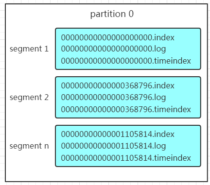

[toc]

# Kafka

## 消息队列通信的模式

### 1.点对点模式

点对点模式通常是基于拉取或者轮询的消息传送模型

**特点：** **发送到队列的消息被一个且只有一个消费者进行处理。**

生产者将消息放入消息队列后，由**消费者主动地拉取消息**进行消费。

**优点：** 消费者拉取消息的频率可以由自己控制。

**缺点：** 消息队列中是否有消息需要消费，在消费者端无法感知，所以在消费者端需要额外的线程去监控。

### 2.发布订阅模式

在发布订阅消息系统中，消息被持久化到一个topic中。**消费者可以订阅一个或多个topic，消费者可以消费该topic中所有的数据，同一条数据可以被多个消费者消费，数据被消费后不会立马删除。**

- 消息的生产者称为**发布者**
- 消息的消费者称为**订阅者**

生产者将消息放入消息队列后，队列会将消息推送给订阅过该类消息的消费者。由于消费者被动接收推送，所以无需感知消息队列是否有待消费的消息。

**缺点：** 由于机器性能不一样，所以处理消息的能力也不一样，但消息队列无法感知消费者消费的速度。

## Kafka

Kafka是一种高吞吐量的**分布式发布订阅**消息系统。


- **Producer**：消息的生产者，是消息的入口。
- **kafka cluster**：
  - **Broker**：kafka实例，每个服务器上有一个或多个kafka的实例，姑且认为每个Broker对应一台服务器。每个kafka集群内的Broker都有一个不重复的编号。
  - **Topic**：消息的主题，可以理解为消息的分类，kafka的数据就保存在topic里。每个Broker上都可以创建多个topic。
  - **Partition**：Topic的分区，每个Topic可以有多个分区，分区的作用是做负载，提高kafka的吞吐量。同一个topic在不同的分区的数据是不重复的，Partition的表现形式就是一个一个的文件夹。
  - **Replication**：每一个分区都有多个副本，用作备胎。当主分区（Leader）故障的时候就会选择一个备胎（Follower）上位，成为Leader。kafka中默认副本的最大数量是10个，且副本的数量不能大于Broker的数量，Follower和Leader绝对是在不同的机器，同一个机器对同一个分区也只可能存放一个副本（包括自己）。
  - **Message**：每一条发送的消息主体。
- **Consumer**：消费者，即消息的消费方，是消息的出口。
- **Consumer Group**：可将多个消费者组成一个消费者组。在kafka的设计中，同一个分区的数据只能被消费者组中的某一个消费者消费。同一个消费者组的消费者可以消费同一个Topic的不同分区的数据，这是为了提高kafka的吞吐量。
- **Zookeeper**：kafka集群依赖Zookeeper来保存集群的元信息，来保证系统的可用性。

### 工作流程分析

#### 发送数据

Producer在写入数据时，**一定是找Leader**，不会直接将数据写入Follower。


1. Producer先从集群获取分区的Leader
2. Producer将消息发送给Leader
3. Leader将消息写入本地文件
4. Followers从Leader拉取消息
5. Followers将消息写入本地后向Leader发送ACK
6. Leader收到所以副本的ACK后向Producer发送ACK

**注意：消息写入Leader后，Follower是主动去和Leader进行同步。Producer采用push模式将数据发布到Broker，每条消息追加到分区中，顺序写入磁盘，所以保证同一分区内的数据是有序的。**


1. 数据会写入不同的分区，那么kafka为什么要做分区呢？
   - **方便扩展**。因为一个Topic可以有多个Partition，所以可以通过扩展机器去轻松的应对日益增长的数据量。
   - **提高并发**。以Partition为读写单位，可以多个消费者同时消费数据，提高了消息的处理效率。
2. 在kafka中，如果某个Topic有多个Partition，Producer该将数据发往哪个Partition？kafka中有几个原则：
   - Partition在写入的时候可以指定需要写入的Partition，如果有指定，则写入对应的Partition。
   - 如果没有指定Partition，但是设置了数据的key，则会根据key的值hash出一个Partition。
   - 如果既没指定Partition，又没有设置key，则会轮询选出一个Partition。
3. Producer向kafka中写入消息时，如何保证消息不丢失？
   - 通过**ACK应答机制**，生产者向队列写入数据时，**设置参数**来确定是否确认kafka接收到数据，这个参数可设置的值为**0、1、all**。
     - 0：Producer往集群发送数据不需要等到集群的返回，不确保消息发送成功。安全性最低但效率最高。
     - 1：Producer往集群发送数据只要Leader应答就可以发送下一条。只能确保Leader发送成功。
     - all：Producer往集群发送数据需要所有的Follower都完成Leader的同步才会发送下一条，确保Leader发送成功和所有的副本都完成备份。安全性最高，但效率最低。
4. 如果向不存在的Topic写数据，能否写入成功？
   - kafka会自动创建Topic，分区和副本的数量默认配置都是1。

#### 保存数据

Producer将数据写入kafka后，集群要保存数据。kafka将数据保存在磁盘。kafka初始会单独开辟一块磁盘空间，顺序写入数据（效率比随机写入高）。

**Partition结构**

每个Topic都可以分为一个或多个Partition。Partition在服务器上的表现形式就是一个一个的文件夹，每个Partition的文件夹下会有多组segment文件，每组segment文件包括.index文件、.log文件、.timeindex文件。log文件就是实际存储message的地方，index和timeindex文件为索引文件，用于检索消息。



- 每个log文件的大小是一样的，但是存储的message数量不一定是相等的，因为每条message的大小不一致。
- 文件命名是以该message最小offset来命名的，如000.index存储offset为0~368795的消息。
- kafka利用**分段+索引**的方式来解决查找效率的问题。

**Message结构**

log文件是实际存储message的地方，Producer往kafka写入也是一条一条的message。那存储在log中的message是什么样子呢？

- **offset**：一个占8byte的有序id号，唯一确定每条消息在Partition内的位置。
- **消息大小**：占用4byte，用于描述消息的大小
- **消息体**：存放的是实际的消息数据（被压缩过），占用的空间根据具体的消息而不一样。

**存储策略**

无论消息是否被消费，kafka都会保存所有的消息，那么对于旧数据的删除策略呢？

- 基于时间，默认配置是168小时（7天）
- 基于大小，默认配置是1073741824

> 注意：kafka读取特定消息的时间复杂度是O(1)，所以删除过期的文件并不会提高kafka的性能。

#### 消费数据

消息存储在log文件后，消费者就可以进行消费了。与Producer相同的是，**消费者在拉取消息的时候也是找Leader拉取**。

多个消费者可以组成一个消费者组（consumer group），每个消费者组都有一个组id。**同一个消费者组的消费者可以消费同一个Topic下不同分区的数据，但是不会组内多个消费者消费同一分区的数据。**


上图是消费者组内消费者数量小于Partition数量的情况，所以会出现某个消费者消费多个Partition数据的情况，消费的速度也就不如只处理一个Partition的消费者的处理速度。因为不会出现多个消费者消费同一个Partition的情况，所以如果消费者数量多于Partition的数量，多出来的消费者不会消费任何Partition的数据。

实际应用中，建议消费者组的consumer数量与partition数量一致。

查找消息时，**如何利用segment+offset配合查找呢？**假如现在需要查找一个offset为368801的message的过程是怎样的呢？


1. 先找到offset的368801message所在的segment文件（利用二分法查找），这里找到的就是在第二个segment文件。
2.  打开找到的segment中的.index文件（也就是368796.index文件，该文件起始偏移量为368796+1，我们要查找的offset为368801的message在该index内的偏移量为368796+5=368801，所以这里要查找的**相对offset**为5）。由于该文件采用的是稀疏索引的方式存储着相对offset及对应message物理偏移量的关系，所以直接找相对offset为5的索引找不到，这里同样利用二分法查找相对offset小于或者等于指定的相对offset的索引条目中最大的那个相对offset，所以找到的是相对offset为4的这个索引。
3. 根据找到的相对offset为4的索引确定message存储的物理偏移位置为256。打开数据文件，从位置为256的那个地方开始顺序扫描直到找到offset为368801的那条Message。

上述机制是建立在offset有序的基础上，利用**segment+有序offset+稀疏索引+二分查找+顺序查找**来查找数据。至此，消费者就能拿到需要处理的数据进行处理了。

每个消费者是怎么记录自己消费的位置呢？

- 早期版本中，消费者将消费到的offset维护Zookeeper中，consumer每间隔一段时间上报一次，这样容易导致重复消费，且性能不好。
- 新版本中，消费者消费到的offset已经直接维护在kafka集群的`_sonsumer_offset`这个Topic中。

### Python脚本

**产生数据**

```python
from pykafka import KafkaClient

# config
hosts_name = 'xxxx'
topic_name = 'web-page'

client = KafkaClient(hosts=hosts_name)

# 查看所有topic
print(client.topics)

topic = client.topics[topic_name]

producer = topic.get_sync_producer()

while True:
    s = input('enter a string: ')
    producer.produce(s.encode())
```

**消费数据**

```python
from pykafka import KafkaClient

hosts_name = 'xxxx'
topic_name = 'web-page'

client = KafkaClient(hosts=hosts_name)
print(client.topics)

topic = client.topics[topic_name]
consumer = topic.get_simple_consumer()

print('print kafka message')

for record in consumer:
    if record is not None:
        valuestr = record.value.decode()
        print(valuestr)

consumer.close()
```

## kafka数据丢失原因

Kafka 消息发送分同步 (sync)、异步 (async) 两种方式，默认使用同步方式，可通过 producer.type 属性进行配置；

通过 request.required.acks 属性进行配置：值可设为 0, 1, -1(all)  -1 和 all 等同

**0 代表：不等待 broker 的 ack**，这一操作提供了一个最低的延迟，broker 一接收到还没有写入磁盘就已经返回，当 broker 故障时有可能丢失数据；

**1 代表：producer 等待 broker 的 ack，partition 的 leader 落盘成功后返回 ack**，如果在 follower 同步成功之前 leader 故障，那么将会丢失数据；

**-1 代表：producer 等待 broker 的 ack，partition 的 leader 和 follower 全部落盘成功后才返回 ack**，数据一般不会丢失，延迟时间长但是可靠性高；但是这样也不能保证数据不丢失，比如当 ISR 中只有 leader 时( ISR 中的成员由于某些情况会增加也会减少，最少就只剩一个 leader)，这样就变成了 acks = 1 的情况；

另外一个就是使用高级消费者存在数据丢失的隐患: 消费者读取完成，高级消费者 API 的 offset 已经提交，但是还没有处理完成Spark Streaming 挂掉，此时 offset 已经更新，无法再消费之前丢失的数据. 解决办法使用低级消费者

### 解决方法

设置同步模式, producer.type = sync, Request.required.acks = -1, replication.factor >= 2 且 min.insync.replicas >= 2

## kafka数据重复原因

- 原因1：acks = -1 的情况下，数据发送到 leader 后 ，部分 ISR 的副本同步，leader 此时挂掉。比如 follower1 和 follower2 都有可能变成新的 leader, producer 端会得到返回异常，producer 端会重新发送数据，数据可能会重复。
- 原因2：另外, 在高阶消费者中，offset 采用自动提交的方式, 自动提交时，假设 1s 提交一次 offset 的更新，设当前 offset = 10，当消费者消费了 0.5s 的数据，offset 移动了 15，由于提交间隔为 1s，因此这一 offset 的更新并不会被提交，这时候我们写的消费者挂掉，重启后，消费者会去 ZooKeeper 上获取读取位置，获取到的 offset 仍为10，它就会重复消费. 解决办法使用低级消费者。

### 解决方法

- 对于原因1：消费者做一层缓存过滤，以数据量为缓存或以时间为缓存都可以解决这个问题。比如加一个缓存区，只要判断数据重复了则不再重复消费即可，然后当缓存的数据超过了1M，则清除一次缓存区；或者直接缓存到redis中，使用redis api来去重，定时清理一下redis中的数据也可以。
- 对于原因2：大多数情况下如果使用消费者手动提交的模式，一般不会出现这种问题（手动提交的情况下如果出现异常，没有执行提交代码，那么代码中做好数据消费的回滚操作即可，更加可控）

