# Kafka

Kafka的三个用途：

- **消息系统**：具备系统解耦、冗余存储、流量削峰、缓冲、异步通信、扩展性、可恢复性等功能。相比传统的消息系统，kafka实现了**消息顺序性保障**和**回溯消费**的功能。
- **存储系统**：相比其他基于内存存储的系统，把消息持久化到磁盘，有效降低了数据丢失的风险。可以把kafka当作长期的数据存储系统来使用是因为**kafka的消息持久化和多副本机制**。
- **流式处理平台**：kafka为每个流行的流式处理框架如Storm，提供可靠的数据来源。Kafka Stream自身也可以处理数据流。

## kafka结构

一个典型的kafka体系架构包括若干个producer，若干broker，若干consumer，以及一个ZooKeeper集群。

**ZooKeeper是kafka用来负责集群元数据的管理（集群、broker、topic、partition等）、控制器的选举等操作，producer将消息发送到broker，broker负责将收到的消息存储到磁盘中，consumer负责从broker订阅并消费消息。**

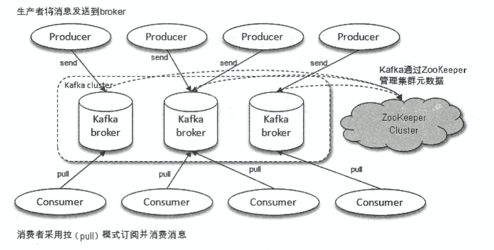

- producer：生产者，发送消息的一方。生产者负责创建消息，然后将其投递到kafka中。
- consumer：消费者，接收消息的一方。消费者连接到kafka上并接收消息。
- broker：服务代理节点，大多数情况下，可以将broker看作一台kafka服务器，前提是这台服务器只部署了一个kafka实例。一个或多个broker组成了一个kafka集群。
- topic：主题，kafka中的消息以主题为单位进行归类，生产者负责将消息发送到特定的主题，消费者订阅主题并进行消费。主题只是一个逻辑上的概念。
- partition：分区，一个topic分为多个partition。同一个主题下的不同分区包含的消息是不同的，分区在存储层面可以看作一个**可追加的日志文件**，**消息在被追加到分区日志文件的时候，会分配一个特定的偏移量（offset）**。kafka中的分区可以分布在不同的broker上，即**一个主题可以横跨多个broker**，以此来提供比单个broker更强大的性能。
- offset：消息在分区中的唯一标识，kafka通过offset保证消息在分区内的顺序性。但**offset并不跨越分区**，即**kafka保证的是分区有序而不是主题有序**。

每条消息发送到broker之前，会根据分区规则选择存储到哪个具体的分区。如果一个主题只对应一个文件，那么这个文件所在的机器I/O将会成为这个主题的性能瓶颈，分区则解决了这个问题。**在创建topic的时候通过指定的参数来设置分区的个数。也可以在topic创建完成之后再修改分区的数量，通过增加分区的数量实现水平扩展。**

**多副本机制**

kafka为分区引入**多副本机制**，同一个分区的不同副本中保存的是相同的消息（同一时刻，副本之间并非完全一样），副本之间是**一主多从**的关系，**leader副本负责处理读写请求，follower副本只负责与leader副本的消息同步。副本处于不同的broker中，当leader副本出现故障，从follower副本中重新选举新的leader副本对外提供服务。**kafka通过多副本机制实现了故障的自动转移，当kafka集群中某个broker失效时，依然可用。

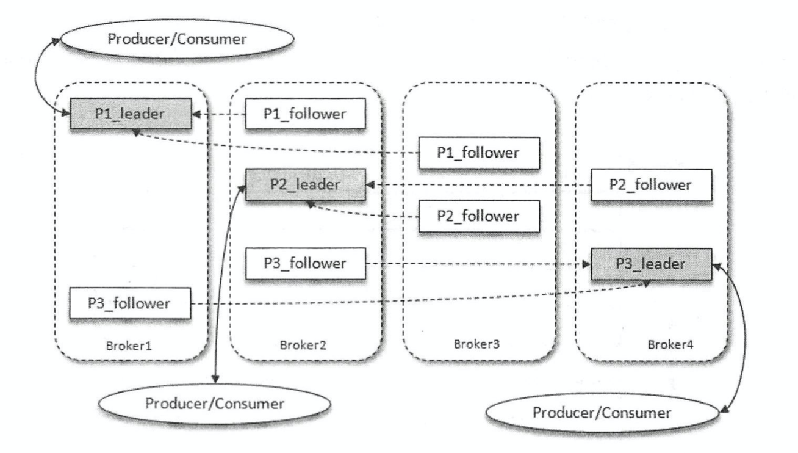

除了多副本机制提升了kafka的容灾能力，在consumer端也具备一定的荣灭能力。consumer使用Pull（拉）模式从服务端拉取消息，并且**保存消费的具体位置**，当消费者宕机后恢复上线时，可以根据之前保存的消费位置重新拉取需要的消息进行消费。

**kafka复制同步机制**

AR（Assigned Replicas）：分区中的所有副本

ISR（In-Sync Replicas）：所有与leader副本保持一定程度同步的副本（包括leader副本）

OSR（Out-of-Sync Replicas）：与leader副本同步滞后过多的副本（不包括leader副本）

HW（High Watermark）：高水位，标识了一个特定的消息偏移量offset，消费者只能拉取到这个offset之前的消息

LEO（Log End Offset）：标识当前日志文件中下一条待写入消息的offset

AR = ISR + OSR，正常情况下，应该所有follower都与leader保持一定程度上的同步，即AR = ISR。

> 消息会先发送到leader副本，然后follower副本才能从leader副本中拉取消息进行同步，同步期间内follower副本相对于leader副本而言会有一定程度的滞后。

leader负责维护和跟踪ISR集合中所有follower副本的滞后状态，当follower副本落后太多或失效时，leader会把它从ISR集合中剔除；如果OSR集合中有follower追上了leader，leader会把它从OSR集合转移至ISR集合。默认情况下，当leader发送故障，需要重新选举时，只有ISR集合中的副本有资格被选举成为新的leader，OSR中的副本没有机会（这也可以通过修改相应的参数配置来改变）。

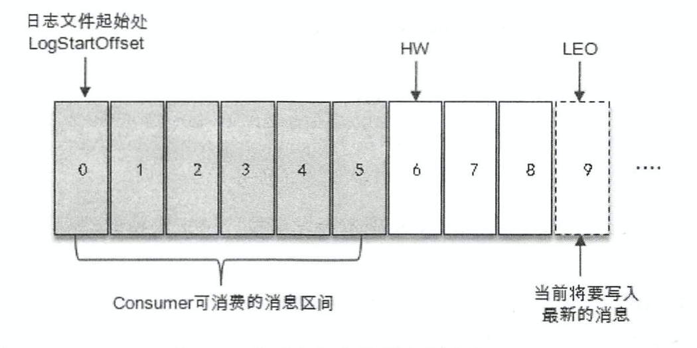

- 上图中，日志文件有9条消息，第一条消息的offset是0，最后一条消息的offset为8，offset为9的消息标识下一条带待写入的消息。日志文件的HW为6，标识消费者只能拉取到offset在0到5之间的消息，offset为6的消息对消费者而言不可见。
- LEO=当前日志分区中最后一条消息的offset+1
- 分区ISR集合中的每个副本会维护自身的LEO，而ISR集合中最小的LEO即为分区的HW。

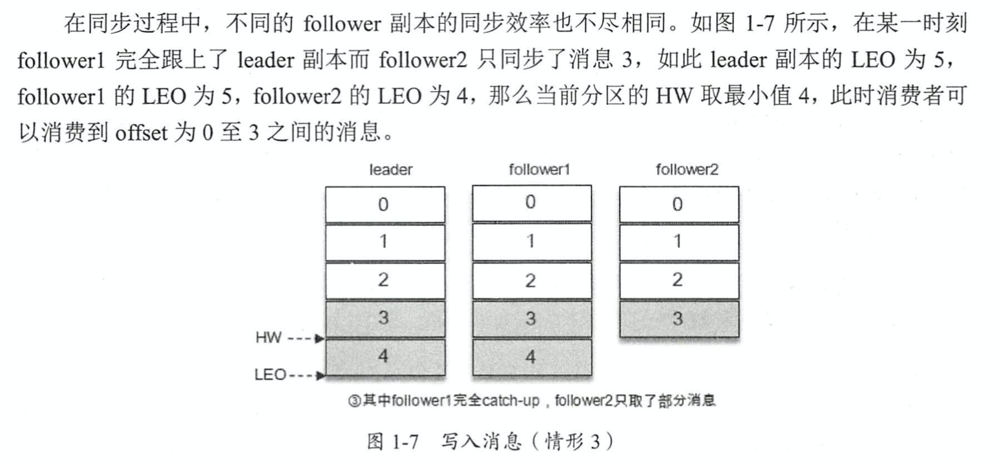

总结：kafka的复制机制不是完全的同步复制，也不是单纯的异步复制，使用ISR的方式有效权衡了数据可靠性和性能之间的关系。

- 同步复制：所有工作的follower都复制完，才被确认为已成功提交，极大降低性能。
- 异步复制：数据只要写入leader副本就被认为是已经成功提交。如果follower没有都复制完而落后于leader，此时leader突然宕机就会造成数据丢失。

# 生产者

KafkaProducer是**线程安全**的。

发送消息主要有三种模式：发后即忘、同步、异步。

- 发后即忘：效率最高，可靠性差，会造成消息丢失。
- 同步发送：可靠性高。要么消息被发送成功，要么发生异常。如果发送异常，则可以捕获并进行相应的处理。性能差，需要阻塞等待一条消息发送完之后才能发送下一条。
- 异步发送：在send方法中指定一个Callback的回调函数，kafka在返回响应时调用该函数来实现异步的发送确认。

消息通过send()方法发往broker的过程中，有可能需要经过拦截器、序列化器和分区器的一系列作用之后才能被真正发往broker。

**序列化**

生产者需要用序列化器将对象转换成字节数组才能通过网络发送给kafka，消费者需要使用反序列化器把从kafka中收到的字节数组转换成相应的对象。生产者使用的序列化器和消费者使用的反序列化器需要一一对应。

**分区器**

消息经过序列化之后就需要确定要发往的分区，如果消息ProducerRecord中指定了partition字段，那么就不需要分区器。partition代表就是要发往的分区号。如果没有指定，那么就需要依赖分区器，根据key来计算partition的值。

如果key不为null，那么默认的分区器会对key进行哈希（MurmurHash2算法），根据得到的哈希值计算分区号，拥有相同的key的消息会被写入同一个分区。如果key为null，那么消息会以轮询的方式发往topic的各个可用分区。

> key不为null，那么计算得到的分区号会是所有分区中的任意一个；如果key为null，那么计算得到的分区号仅为可用分区中的任意一个。

**生产者拦截器**

kafka一共有两种拦截器：生产者拦截器和消费者拦截器。

- 用来在消息发送前做一些准备工作，比如按照某个规则过滤不符合要求的消息
- 用来在发送回调逻辑前做一些定制化的需求，比如统计类的工作。

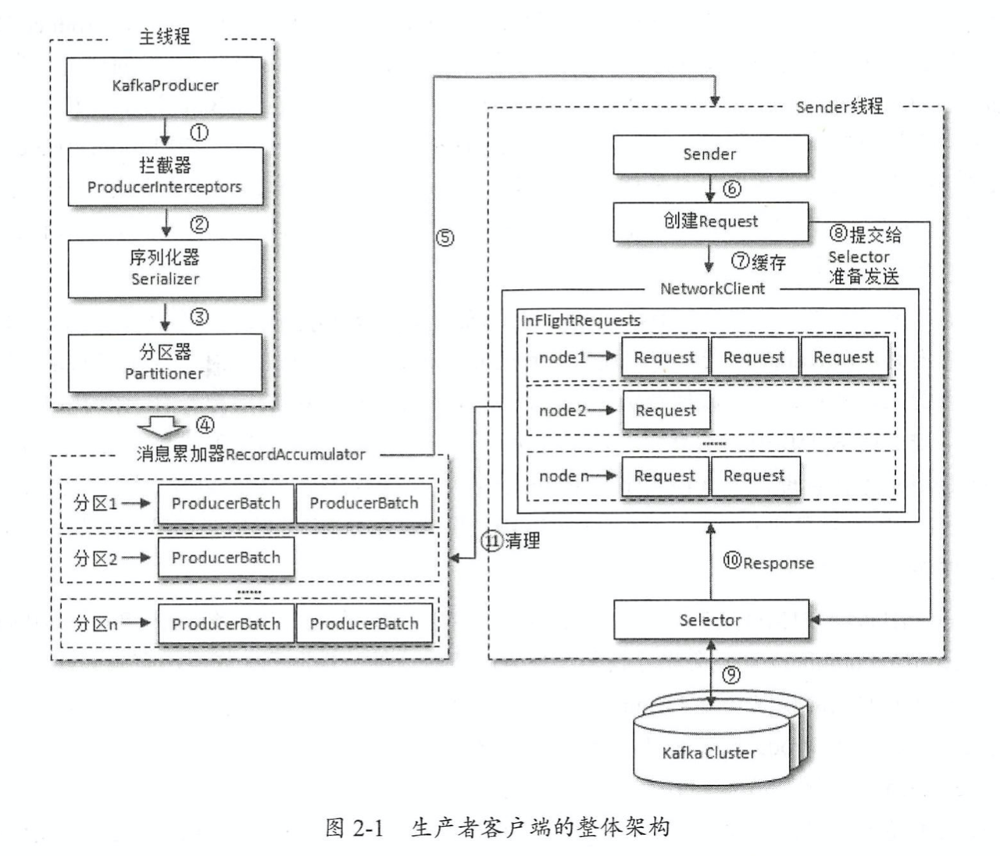

生产者客户端由两个线程协调运行，分别是主线程和Sender线程。

在主线程中由KafkaProducer创建消息，通过可能的拦截器、序列化器和分区器之后缓存到消息累加器中。Sender线程负责从消息累加器中获取消息并将其发送到kafka中。

- 消息累加器：用来缓存消息以便sender线程可以批量发送，进而减少网络传输的资源消耗以提升性能。消息累加器的缓存大小可以通过生产者客户端参数buffer.memory配置，默认是32MB。

在消息累加器内部为每个分区都维护了一个双端队列，队列的内容是ProducerBatch。一个ProducerBatch中可以包含一个或多个ProducerRecord。ProducerRecord是生产者创建的消息，ProducerBatch是指一个消息批次。

消息在网络上都是以字节的形式传输，在发送之前需要创建一块内存区来保存对应的消息，对于内存区频繁的创建和释放都是比较耗费资源的，消息累加器内部有一个BufferPool来实现ByteBuffer的复用，以实现缓存的高效利用。不过BufferPool只针对特定大小的ByteBuffer进行管理。

**元数据更新**

InFlightRequests：缓存了已经发出去但还没有收到响应的请求。

InFlightRequests可以获得leastLoadedNode，即所有Node中负载最小的那一个，负载最小是通过每个Node在InFlightRequests中还未确认的请求决定的，未确认的请求越多则认为负载越大。

KafkaProducer要将此信息追加到指定topic的某个分区所对应的leader副本之前，首先要知道topic的分区数量，然后经过计算得出目标分区，之后kafkaProducer需要知道目标分区的leader副本所在的broker节点的地址、端口等信息才能建立连接，最终才能将消息发送到kafka，这一过程中所需要的信息都属于元数据信息。

元数据是指kafka集群的元数据。

### 重要的生产者参数

**acks**

这个参数用来指定分区中必须要有多少个副本收到这条消息，之后生产者才会认为这条消息是成功写入的。

- acks = 1，默认值是1.生产者发送消息后，**只要分区的leader成功写入消息**就会收到来自服务端的成功响应。但可能会出现消息写入leader副本并返回成功响应给生产者，且在被其他follower副本拉取之前leader副本崩溃，那么消息还是会丢失。
- acks = 0，生产者发送消息之后**不需要等待任何服务端的响应**。如果消息从发送到写入kafka的过程中出现了某些异常，导致kafka没有收到这条消息，那么生产者也无从得知，消息也就丢失了。但acks设置为0，可以达到最大的吞吐量。
- acks = -1或acks = all，生产者在消息发送之后，**需要等待ISR中的所有副本都成功写入消息**之后才能够收到来自服务端的成功响应。acks = -1可以达到最强的可靠性，但并不意味着消息就一定可靠，因为ISR中可能只有leader副本，就退化成了acks = 1的情况。

**max.request.size**

用来限制生产者客户端能发送的消息的最大值，默认是1MB。

**retries**

用来配置生产者重试的次数，默认值为0。即在发生异常的时候不进行任何重试动作。消息在生产者发出到成功写入服务器之前可能发生一些临时性的异常，比如网络抖动、leader副本的选举等，这种异常可以通过内部重试来恢复而不是一昧地将异常抛给生产者的应用程序。如果重试达到设定的次数，那么生产者就会放弃重试并返回异常。

**retry.backoff.ms**

用来设定两次重试之间的时间间隔，默认为100。

# 消费者

kafkaConsumer是非线程安全的。

消费者负责订阅kafka中的topic，并且从订阅的主题上拉取消息。与其他消息中间件不同的是：**kafka有消费组的概念，每个消费者都有一个对应的消费组。当消息发布到topic后，只会被投递给订阅它的每个消费组中的消费者。**

**消费组之间是互不影响的。每个消费者只能消费所分配到的分区中的消息。即每个分区只能被一个消费组中的一个消费者所消费。**

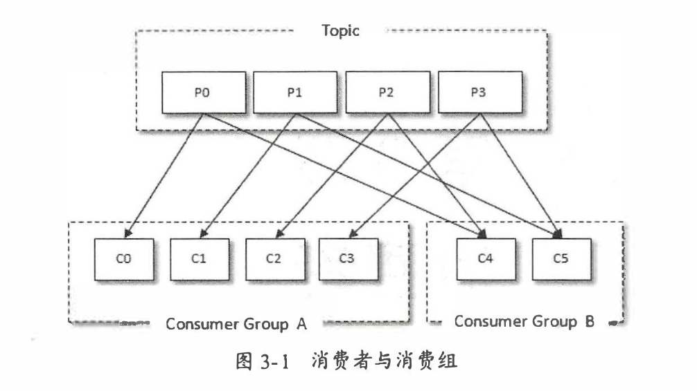

消费者和消费组这种模型关系可以让整体的消费能力具备横向伸缩性，可以通过增加或减少消费者的个数来提高或降低整体的消费能力。**但对于分区数固定的情况，一味增加消费者并不会让消费能力一直得到提升。如果消费者过多，出现了消费者的个数大于分区个数的情况，就会有消费者分配不到任何分区。**

kafka同时支持点对点模式和发布/订阅模式。

- 如果所有的消费者都隶属于同一个消费组，那么所有的消息都会被均衡地投递给每一个消费者，即每条消息只会被一个消费者处理，就相当于点对点模式的应用。
- 如果所有的消费者都隶属于不同的消费组，那么所有的消息都会被广播给所有的消费者，即每条消息会被所有的消费者处理，这就相当于发布/订阅模式。

消费组是逻辑上的一个概念，将旗下的消费者归为一类。但消费者并非逻辑上的概念，可以是一个线程也可以是一个进程。

**消息消费的两种模式**

- 推模式：服务端主动将消息推送给消费者
- 拉模式：消费者主动向服务端发起请求来拉取消息，**kafka中的消费是基于拉模式的。**

kafka中的消息消费是一个不断轮旋的过程，消费者所要做的就是重复调用pull方法，poll()方法返回的是所订阅的主题（分区）上的一组消息。

pull()方法中有一个超时时间参数timeout，用来控制pull()方法的阻塞时间，在消费者的缓冲区里没有可用数据时会发生阻塞。

消费者消费到的每条消息的类型为ConsumerRecord，其中的topic代表所属主题名称，partition为所在分区的编号，offset表示消息在所属分区的偏移量，timestamp表示时间戳，timestampType表示时间戳类型，有CreateTime和LogAppendTime两种类型，分别代表消息创建的时间戳和消息追加到日志的时间戳。

### 位移提交

对于kafka中的分区而言，每条消息都有唯一的offset，用来表示消息在分区中对应的位置。**消费者使用offset表示消费到分区中某个消息所在的位置。**

在每次调用pull方法时，它返回的是还没有被消费过的消息集，要做到这一点，就需要记录上一次消费时的位移。并且这个消费位移必须做持久化保存，而不是只保存在内存中，否则消费者重启之后就不知道之前的消费位移了。当有新的消费者加入时，比如会有再均衡的动作，对于同一分区而言，它可能在再均衡动作之后分配给新的消费者，如果不持久化保存消费位移，那么这个新的消费者也无法知晓之前的消费位移。

在旧消费者客户端中，消息位移是存储在ZooKeeper中的，而在新消费者客户端中，**消费位移存储在kafka内部的topic：__consumer_offsets中**。消费者在消费完消息后需要执行消费位移的提交。

**注意：提交的offset是下一条需要拉取的消息的位置。**下图中，消费者提交的消费位移是x+1。

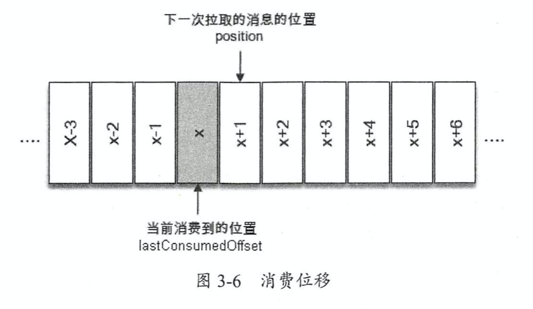

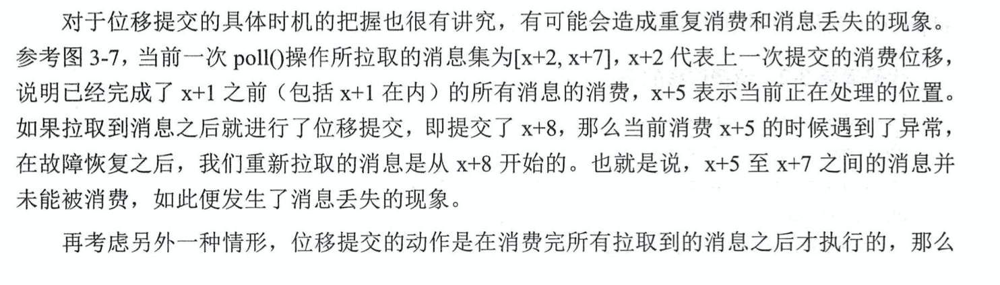

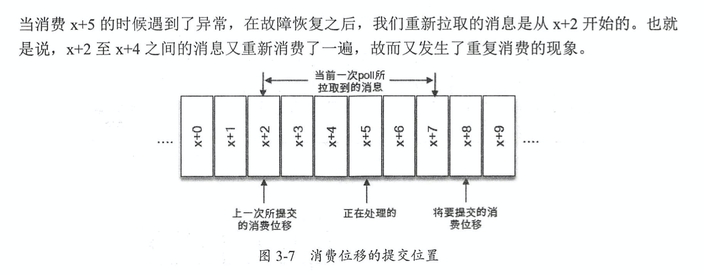

kafka中默认的消费位移的提交方式是**自动提交**，这个是由消费者客户端参数配置决定的。自动提交不是每消费一条消息就提交一次，而是**定期提交**，默认的周期是5秒，也可以通过修改客户端参数进行设置。

默认方式下，消费者每隔5秒，会将拉取到的每个分区中最大的消息位移进行提交。自动位移提交的动作是在pull方法的逻辑里完成的，在每次真正向服务端发起拉取请求之前会检查是否可以进行位移提交，如果可以，那么就会提交上一次轮询的位移。

**kafka消费的编程逻辑中位移提交是一大难点，自动提交消费位移的方式非常简便，但可能会有重复数据和消息丢失的问题。**

- 数据重复：假设刚刚提交完一次消费位移，然后拉取一批消息进行消费，在下一次自动提交消费位移之前，消费者崩溃了，那么又得从上一次位移提交的地方重新开始消费，导致数据重复。

- 消息丢失：

  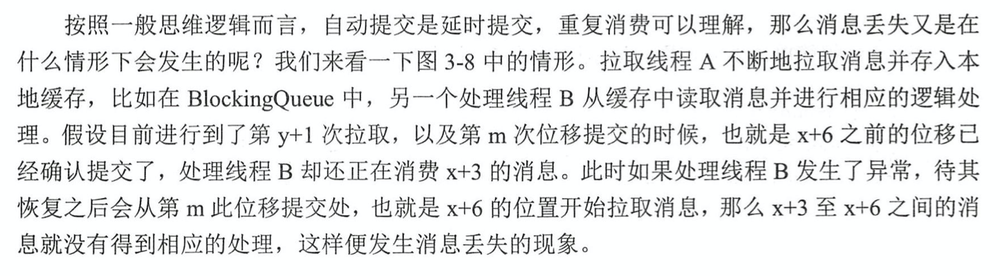

  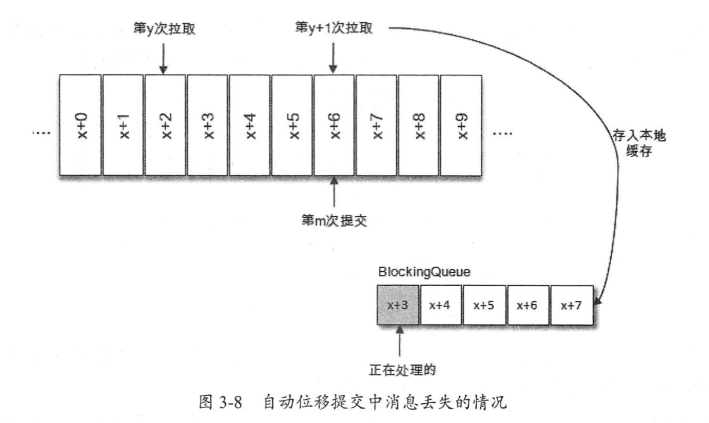

在Kafka中提供了**手动位移提交**的方式，需要将消息写入数据库、写入本地缓存，或者是更加复杂的业务处理，所有的业务处理完成才能认为消息被成功消费，这就解决了后提交中的消息丢失问题。

怎么解决消息重复呢？让业务处理部分，或者叫作消费者应用程序，来储存offset，从而**把业务处理与位移提交绑定成原子操作**。比如业务处理结果需要写进数据库，我们把位移也提交到数据库，实际操作中，让写入业务结果和写入offset绑定在一个事务内，要么都成功要么都失败。

手动位移提交分为同步提交和异步提交，异步性能更好，因为它不会阻碍消费者线程。提交有可能会失败，如直接利用原子性重来一次业务处理过程效率太低，所以选择重试。但是，这又引入了一个问题，就是在异步提交中，前一次失败了，后一次提交成功了，但此时前一次的重试来了，这样就把后一次的提交覆盖了。怎么解决呢？设置一个**递增的序号**来维护异步提交的顺序，每次位移提交之后就增加序号相对应的值。在遇到位移提交失败需要重试的时候，可以检查序号的值大小，如果前者小于后者，则说明有更大的位移己经提交了，不需要再进行本次重试。

**指定位移消费**

在kafka中每当消费者查找不到所记录的消费位移时，会根据消费者客户端参数auto.offset.reset的配置来决定从何处开始进行消费。

**多线程实现**

kafkaProducer是线程安全的，但KafkaConsumer是非线程安全的。

kafkaConsumer中定义了一个acquire()方法，用来检测当前是否只有一个线程在操作，若有其他线程正在操作则会抛出异常。

kafkaConsumer中的每个公用方法在执行所要执行的动作之前都会调用acquire()方法，只有wakeup()方法是个例外。acquire方法不同于锁，它不会造成阻塞等待。它是通过线程操作计数标记的方式来检测线程是否发生了并发操作，以此来保证只有一个线程在操作。acquire()和release()方法成对出现，表示相应的加锁和解锁操作。

KafkaConsumer是非线程安全的，也就是说，我们不能在多线程中共享一个KafkaConsumer。不过，这并不意味着消费时只能单线程。可以创建多个线程，一个线程对应一个KafkaConsumer实例；也可以创建一个线程，对应一个KafkaConsumer，但是用线程池来进行业务处理。不过这又会涉及到如何同步，使得是顺序处理的问题。