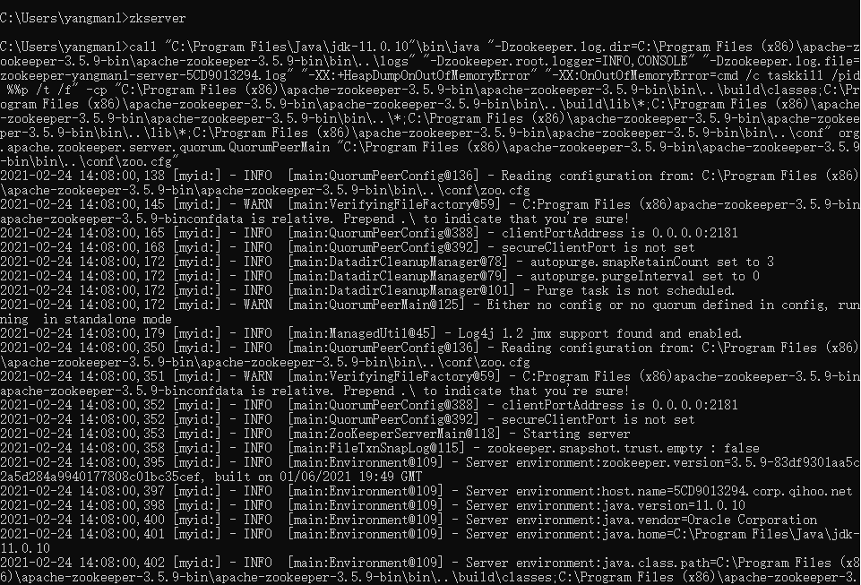
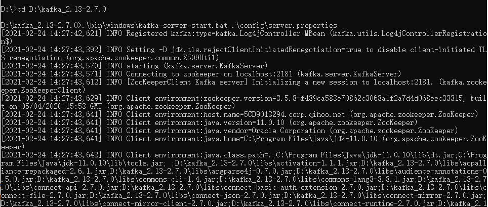

# Kafka环境搭建（Windows）

## 1.安装JDK

电脑之前已安装JDK11。

DOS中输入`java -version`，查看是否安装成功。

## 2.ZooKeeper搭建

1. 建议下载稳定版。
   - 下载地址：[http://mirrors.hust.edu.cn/apache/zookeeper/](http://mirrors.hust.edu.cn/apache/zookeeper/)
2. 下载之后解压，路径为`C:\Program Files (x86)\apache-zookeeper-3.5.9\apache-zookeeper-3.5.9`
3. 在`apache-zookeeper-3.5.9`目录下新建文件夹`data`，路径为`C:\Program Files (x86)\apache-zookeeper-3.5.9\apache-zookeeper-3.5.9\conf\data`
4. 进入zookeeper的配置目录，路径为`C:\Program Files (x86)\apache-zookeeper-3.5.9\apache-zookeeper-3.5.9\conf`
   - 复制`zoo_sample.cfg`的副本，命名为`zoo.cfg`
   - 记事本打开`zoo.cfg`
   - 找到并编辑`dataDir=C:\\Program Files (x86)\\apache-zookeeper-3.5.9\\apache-zookeeper-3.5.9\\conf\\data`
5. 添加系统环境变量
   -  在系统变量中添加`ZOOKEEPER_HOME =C:\Program Files (x86)\apache-zookeeper-3.5.9\apache-zookeeper-3.5.9`
   - 编辑path系统变量，添加为路径`%ZOOKEEPER_HOME%\bin`
6. 在zoo.cfg文件中修改默认的Zookeeper端口（默认端口2181）
7. Dos下运行：zkserver
   - 出现问题：错误: 找不到或无法加载主类 org.apache.zookeeper.server.quorum.QuorumPeerMain
   - 解决方案：重新下载`apache-zookeeper-3.5.9-bin`包，然后解压使用，重复上述流程
   - [参考网站](https://blog.csdn.net/yemuyouhan/article/details/106959830)
8. 搭建成功

## 3.Kafka搭建

1. 下载地址：[http://kafka.apache.org/downloads.html](http://kafka.apache.org/downloads.html)
2. 下载后解压，路径为`D:\kafka_2.13-2.7.0`
3. 新建空文件夹logs，路径为`D:\kafka_2.13-2.7.0\logs`
4. 进入config目录，编辑 server.properties文件
   - 找到并编辑`log.dirs=D:\\kafka_2.13-2.7.0\\logs`
   - 找到并编辑`zookeeper.connect=localhost:2181`。表示本地运行。
   - Kafka会按照默认，在9092端口上运行，并连接zookeeper的默认端口：2181

## 4. 运行

**请确保在启动Kafka服务器前，Zookeeper实例已经准备好并开始运行。（就是开着Zookeeper窗口不要关）**

1. 在路径`D:\kafka_2.13-2.7.0`下打开命令窗口。
2. 运行：`.\bin\windows\kafka-server-start.bat .\config\server.properties`
3. 可能会报错：此时不应有 \kafka_2.13-2.7.0\bin\windows\../../config/log4j.properties。
   - 解决方案：将kafka解压到路径中**没有空格的文件夹**下，如`D:\kafka_2.13-2.7.0`
4. 重复`3.Kafka搭建`中流程，再次运行`.\bin\windows\kafka-server-start.bat .\config\server.properties`

参考网站：

- [https://blog.csdn.net/weixin_37770023/article/details/81807942](https://blog.csdn.net/weixin_37770023/article/details/81807942)
- [https://blog.csdn.net/qq_34721505/article/details/105741287](https://blog.csdn.net/qq_34721505/article/details/105741287)

