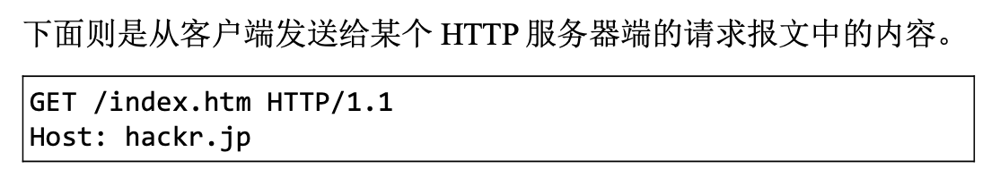
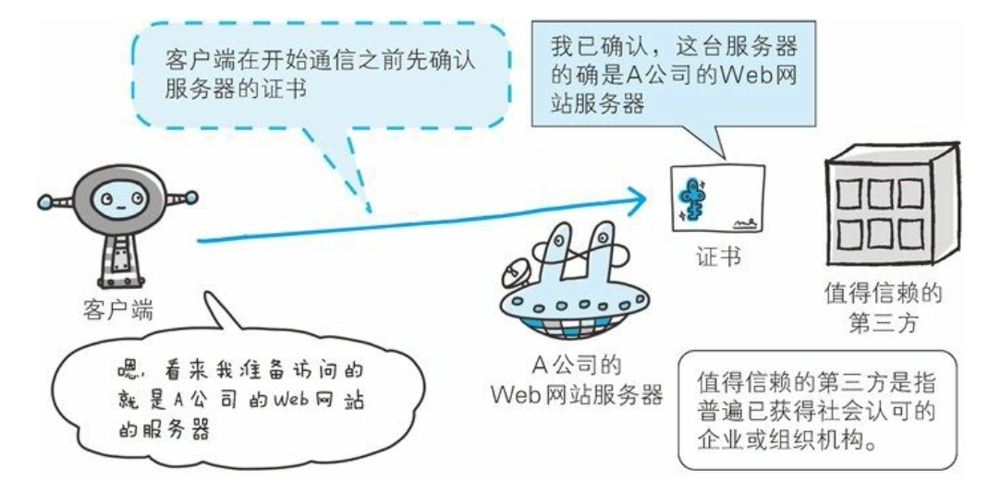

[toc]

# HTTP基础

Web使用HTTP（HyperText Transfer Protocol，超文本传输协议）作为规范，完成从客户端多服务端等一系列运作流程。

Web是建立在HTTP协议上通信的。

URL：Uniform Resource Locator，统一资源定位符。

HTTP是基于TCP/IP协议族。

## TCP/IP协议族

TCP/IP协议族是分层的，按层次分为4层：应用层、传输层、网络层、数据链路层。

分层的好处：便于修改和替换某层使用的协议；分层之后各层的任务相对简单，无需考虑其它层是如何实现的。

**应用层**：向用户提供了应用服务时通信的活动，FTP、DNS、HTTP。

**传输层**：提供处于网络连接中的两台计算机之间的数据传输。TCP、UDP。

**网络层**：处理网络上流动的数据包，数据包是网络传输的最小数据单位。该层规定了通过怎样的路径到达对方计算机，并把数据包传送给对方。IP。

**链路层**：处理连接网络的硬件部分。

使用TCP/IP协议族进行网络通信时，会通过分层顺序和对方进行通信。发送端从应用层往下走，接收端则从链路层往上走。

> 首先作为发送端的客户端在应用层 (HTTP 协议)发出一个想看某个 Web 页面的 HTTP 请求。
>
> 接着，为了传输方便，在传输层(TCP 协议)把从应用层处收到的数 据(HTTP 请求报文)进行分割，并在各个报文上打上标记序号及端 口号后转发给网络层。
>
> 在网络层(IP 协议)，增加作为通信目的地的 MAC 地址后转发给链 路层。这样一来，发往网络的通信请求就准备齐全了。
>
> 接收端的服务器在链路层接收到数据，按序往上层发送，一直到应用 层。当传输到应用层，才能算真正接收到由客户端发送过来的 HTTP 请求。

## IP、TCP、DNS

**IP协议**

IP协议是把各种数据包传送给对方。保证确实传送到对方那里，两个重要的条件是**IP地址和MAC地址**。

- IP地址指明节点被分配到的地址
- MAC地址是指网卡所属的固定地址
- IP地址可以和MAC地址配对，IP地址可变，MAC地址基本不会改变。

**ARP协议凭借MAC地址进行通信。**IP间通信依赖MAC地址。在网络上，通信的双方在同一局域网 (LAN)内的情况是很少的，通常是经过多台计算机和网络设备中转 才能连接到对方。而在进行中转时，会利用下一站中转设备的 MAC 地址来搜索下一个中转目标。这时，会采用 ARP 协议(Address Resolution Protocol)。**ARP 是一种用以解析地址的协议，根据通信方 的 IP 地址就可以反查出对应的 MAC 地址。**这种机制叫**路由选择**。

**TCP协议**

TCP 位于传输层，提供可靠的字节流服务。字节流服务(Byte Stream Service)是指，为了方便传输，将大块数据分割成以报文段(segment)为单位的数据包进行管理。而可靠的传输服务是指，能够把数据准确可靠地传给对方。

TCP协议为了更容易传送大数据才把数据分割，且TCP协议能够确认数据最终是否送达到对方。

**TCP协议采用三次握手保证可靠传输，握手过程中使用了TCP的标记——SYN（synchronize）和ACK（acknowledgement）。**

发送端首先发送一个带 SYN 标志的数据包给对方。接收端收到后， 回传一个带有 SYN/ACK 标志的数据包以示传达确认信息。最后，发 送端再回传一个带 ACK 标志的数据包，代表“握手”结束。

**DNS服务**

提供域名到IP地址之间的解析服务。计算机被赋予IP地址、主机名、域名。

用户通常使用主机名或域名来访问对方的计算机，而不是直接通过IP地址访问。

**DNS协议提供通过域名查找IP地址，或逆向从IP地址反查域名的服务。**

**输入一个URL，解析和传输的过程：**

## URI和URL

- URI（Uniform Resource Identifier，统一资源标识符），由某个协议方案表示的资源的定位标识符。协议方案指访问资源所使用的协议类型名称。采用HTTP协议时，协议方案是http。
- URL（Uniform Resource Locator，统一资源定位符）
- URI用字符串标识某一互联网资源，URL表示资源的地点（互联网上所处的位置）。URL是URI的子集。

URI的格式：

# HTTP协议

## 1. HTTP协议用于客户端和服务端之间的通信

- 请求访问文本或图像等资源的一端为客户端
- 提供资源响应的一端为服务器端
- 两台计算机之间使用HTTP协议通信时，在一条通信线路上必有一端是客户端，另一端则是服务器端。
- 两台计算机作为客户端和服务器端的角色有可能会互换。

## 2. 通过请求和响应的交换达成通信

HTTP协议规定，请求从客户端发出，最后服务端响应该请求并返回。即肯定是从客户端开始建立通信的，服务器端在没有接收到请求之前不会发送响应。

- 请求报文由请求方法、请求URI、协议版本、可选的请求首部字段和内容实体构成。

	

- 响应报文基本上由协议版本、状态码、用以解释状态码的原因短语、可选的响应首部字段以及实体主体构成。

​	

## 3. HTTP是不保存状态的协议

- HTTP协议自身不对请求和响应之间的通信状态进行保存。即在HTTP这个级别，协议对于发送过的请求或响应都不做持久化处理。
- 使用HTTP协议，每当有新的请求发送时，就会有对应的新响应产生。协议本身并不保留之前一切的请求或响应报文的信息。这是为了更快地处理大量事务，确保协议的可伸展性。
- HTTP/1.1是无状态协议，为了能管理状态，引入了Cookie技术。

## 4. 请求URI定位资源

- HTTP协议使用URI定位互联网上的资源。
- 当客户端请求访问资源而发送请求时，URI需要将作为请求报文中的请求URI包含在内。
- 如果不是访问特定的资源而是对服务器本身发起请求，可以使用*来代替URI。

## 5. 告知服务器意图的HTTP方法

### GET：获取资源

GET方法用来请求访问已被URI识别的资源。指定的资源经服务器端解析后返回响应内容。

### POST：传输实体主体

POST方法用来传输实体的主体。

GET方法也可以传输实体的主体，但一般用POST方法。POST的主要目的并不是获取响应的主体内容。

### PUT：传输文件

PUT方法用来传输文件。就像FTP协议的文件上传一样，要求在请求报文的主体中包含文件内容，然后保存到请求URI指定的位置。

HTTP/1.1的PUT方法自身不带验证机制，任何人都可以上传文件，存在安全性问题，因此一般的Web网站不使用该方法。若配合Web应用程序的验证机制，或架构设计采用REST（REpresentational State Transfer，表征状态转移）标准的同类Web网站，就有可能会开放使用PUT方法。

### HEAD：获得报文首部

HEAD方法和GET方法一样，只是不返回报文主体部分。用于确认URI的有效性及资源更新的日期时间等。

### DELETE：删除文件

DELETE方法用来删除文件，与PUT相反的方法。DELETE方法按请求URI删除指定的资源。

HTTP/1.1 的 DELETE 方法本身和 PUT 方法一样不带验证机 制，所以一般的 Web 网站也不使用 DELETE 方法。当配合 Web 应用 程序的验证机制，或遵守 REST 标准时还是有可能会开放使用的。

### OPTIONS：询问支持的方法

OPTIONS方法用来查询针对请求URI指定的资源支持的方法。

### TRACE：追踪路径

TRACE方法是让Web服务器端将之前的请求通信环回给客户端的方法。

发送请求时，在 Max-Forwards 首部字段中填入数值，每经过一个服 务器端就将该数字减 1，当数值刚好减到 0 时，就停止继续传输，最 后接收到请求的服务器端则返回状态码 200 OK 的响应。

客户端通过 TRACE 方法可以查询发送出去的请求是怎样被加工修改 / 篡改的。这是因为，请求想要连接到源目标服务器可能会通过代理 中转，TRACE 方法就是用来确认连接过程中发生的一系列操作。

但是，TRACE 方法本来就不怎么常用，再加上它容易引发 XST(Cross-Site Tracing，跨站追踪)攻击，通常就更不会用到了。

### CONNECT：要求用隧道协议连接代理

CONNECT方法要求在与代理服务器通信时建立隧道，实现用隧道协议进行TCP通信。主要使用SSL（Secure Socket Layer，安全套接层）和TLS（Transport Layer Security，传输层安全）协议把通信内容加密后经网络隧道传输。

## 6. 使用方法下达命令

方法可以指定请求的资源按期望产生某种行为。

HTTP/1.0和HTTP/1.1支持的方法：

## 7. 持久连接节省通信量

HTTP协议的初始版本中，每进行一次HTTP通信就要断开一次TCP连接。因为当年的通信情况，都是些容量很小的文本传输。随着HTTP的普及，文档中包含大量图片的情况越来越多。

> 比如，使用浏览器浏览一个包含多张图片的 HTML 页面时，在发送 请求访问 HTML 页面资源的同时，也会请求该 HTML 页面里包含的 其他资源。因此，每次的请求都会造成无谓的 TCP 连接建立和断 开，增加通信量的开销。
>
> 

### 持久连接

- 特点：只要任意一端没有明确提出断开连接，则保持TCP连接状态。
- 好处：减少了TCP连接的重复建立和断开造成的额外开销，减轻了服务器端的负载。并且，在减少开销的那部分时间，使HTTP请求和响应能够更早结束，使得web页面的显示速度得到相应提高。
- HTTP/1.1中，所有的连接默认都是持久连接。

### 管线化

持久连接使得多数请求以管线化（pipelining）方式发送成为可能。

- **之前**：发送请求后需要等待并收到响应，才能发送下一个请求。
- **管线化技术出现后**：不用等待响应也可直接发送下一个请求。可以同时并行发送多个请求，而不需要一个接一个地等待响应了。

管线化技术比持久连接还要快，请求数越多，时间差就越明显。

## 8. 使用Cookie的状态管理

HTTP是无状态协议，它不对之前发生过的请求和响应的状态进行管理。即**无法根据之前的状态进行本次的请求处理**。

- 存在的问题：要求登录认证的Web页面本身无法进行状态的管理，那么每次跳转新页面不是要再次登录就是要在每次请求报文中附加参数来管理登录状态。
- 无状态协议的好处：减少服务器的CPU及内存资源的消耗。

为**保留无状态协议的特征**，同时**解决类似的矛盾问题**，引入了**Cookie技术**。

**Cookie技术通过在请求和响应报文中写入Cookie信息来控制客户端的状态。**

- Cookie会根据服务器端发送的响应报文内的`Set-Cookie`的首部字段信息，通知客户端保存Cookie。
- 下次客户端再往服务器发送请求时，客户端会自动在请求报文中加入Cookie值后发送出去。
- 服务端发现客户端发送过来的Cookie后，会去检查是从哪个客户端发来的连接请求，然后对比服务器上的记录，最后得到之前的状态信息。

# HTTP报文内的HTTP信息

HTTP通信过程包括**从客户端发往服务器端的请求**及**从服务器端返回客户端的响应**。

## HTTP报文

HTTP报文是由多行（CR+LF为换行符）数据构成的字符串文本。分为请求报文和响应报文。HTTP可分为报文首部和报文主体两部分，并不一定要有报文主体。

- 报文：HTTP通信的基本单位。
- 实体：作为请求或响应的有效载荷数据（补充项）被传输。

HTTP报文的主体用于传输请求或响应的实体主体。通常，报文主体等于实体主体。**只有当传输中进行编码操作时，实体主体的内容发生变化，才会导致它与报文主体产生差异。**

## 编码提升传输速率

### 压缩传输的内容编码

内容编码指明应用在实体内容上的编码格式，并保持实体信息原样压缩。内容编码后的实体由客户端接收并负责解码。

常见的内容编码：

- gzip
- compress (UNIX系统的标准压缩)
- deflate
- Identity

### 分隔发送的分块传输编码

传输大容量数据时，通过把数据分割成多块，能够让浏览器逐步显示页面。

分块传输编码会将实体主体分成多个部分，每一块用十六进制来标记块的大小，实体主体的最后一块使用“0(CR+LF)”来标记。

使用分块传输编码的实体主体会由接收的客户端负责解码，恢复到编码前的实体主体。

## 获取部分内容的范围请求

如果下载过程中遇到网络中断的情况，那就必须重头开始。为解决上述问题，需要一种可恢复的机制。**恢复是指能从之前下载中断处恢复下载。**

为实现该功能需要指定下载的实体范围，指定范围发送的请求叫做范围请求。

针对范围请求，响应会返回状态码为**206 Partial Content**的响应报文。

如果服务器端无法响应范围请求，则会返回状态码**200 OK**和完整的实体内容。

# HTTP状态码

HTTP状态码表示客户端HTTP请求的返回结果、标记服务器端的处理是否正常、通知出现的错误等工作。

- 状态码用来告知服务器端返回的请求结果
  - 1XX：信息性状态码，接收的请求正在处理
  - 2XX：成功状态码，请求正常处理完毕
  - 3XX：重定向状态码，需要进行附加操作以完成请求
  - 4XX：客户端错误状态码，服务器无法处理请求
  - 5XX：服务器错误状态码，服务器处理请求出错

常见的14种状态码：

- 200 OK：客户端发来的请求在服务器端被正常处理了
- 204 No Content：表示服务器接收的请求已成功处理，但在返回的响应报文中不含实体的主体部分。
- 206 Partial Content：表示客户端进行了范围请求，而服务器成功执行了这部分的GET请求。
- 301 Moved Permanently：永久性重定向，表示请求的资源已被分配了新的URI，以后应使用资源现在所指的URI。如果已经把资源对应的 URI 保存为书签了，这时应该按 Location 首部字段提示的 URI 重新保存。
- 302 Found：临时性重定向，表示请求的资源已被分配了新的URI，希望用户本次能使用新的URI访问。用户把 URI 保存成书签，但不会 像 301 状态码出现时那样去更新书签，而是仍旧保留返回 302 状态码 的页面对应的 URI。
- 303 See Other：表示由于请求对应的资源存在另一个URI，应使用**GET方法**定向获取请求的资源。
- 304 Not Modified：表示客户端发送附带条件的请求时，服务器端允许请求访问资源，但未满足条件的情况。
- 307 Temporary Redirect：临时重定向，禁止POST变换成GET。
- 400 Bad Request：表示请求报文中存在语法错误。
- 401 Unauthorized：表示发送的请求需要有通过HTTP认证的认证信息。
- 403 Forbidden：表示对请求资源的访问被服务器拒绝了。
- 404 Not Found：表明服务器上无法找到请求的资源。
- 500 Internal Server Error：表明服务器端在执行请求时发生了错误。
- 503 Service Unavailable：表明服务器暂时处于超负荷或正在进行停机维护，现在无法处理请求。

# Web服务器

一台Web服务器可搭建多个独立域名的Web网站，也可作为通信路径上的中转服务器提升传输效率。

- 利用**虚拟主机**的功能，用单台虚拟主机实现多个域名。
  - 在相同的IP地址下，由于虚拟主机可以寄存多个不同主机名和域名的Web网站，因此在发送HTTP请求时，必须在Host首部内完整指定主机名或域名的URI。
- HTTP通信时，除客户端和服务器之外，还有一些用于通信数据转发的应用程序，如**代理、网关、隧道**。
  - 代理：有转发功能的应用程序，是服务器和客户端的“中间人”。接收由客户端发送的请求并转发给服务器，同时接收服务器返回的响应并转发给客户端。代理不改变请求URI。利用缓存技术减少网络带宽的流量，组织内部针对特定网站的访问控制，以获取访问日志为主要目的。
  - 网关：转发其他服务器通信数据的服务器，接收从客户端发送来的请求时，就像自己拥有资源的源服务器一样对请求进行处理。客户端可能不会察觉，通信目标是网关。利用网关可以由HTTP请求转化为其他协议通信。因为可以在客户端和网关之间的通信线路上加密以确保连接的安全，因此网关能提高通信的安全性。
  - 隧道：在相隔甚远的客户端和服务器两者之间进行中转，并保持双方通信连接的应用程序。隧道本身不会解析HTTP请求，请求保持原样中转给之后的服务器。所以隧道本身是透明的。隧道会在通信双方断开连接时结束。

**缓存**

- 缓存是指代理服务器或客户端本地磁盘内保存的资源副本。
- 利用缓存，减少对源服务器的访问。节省通信流量和通信时间。

# HTTP首部

HTTP协议的请求和响应报文中必定包含HTTP首部，首部内容为客户端和服务端分别处理请求和响应提供所需要的信息。

- HTTP请求报文包括方法、URI、HTTP版本、HTTP首部字段等
- HTTP响应报文包括HTTP版本、状态码（数字和原因短语）、HTTP首部字段

## HTTP/1.1通用首部字段

通用首部字段是请求报文和响应报文双方都会使用的首部。

**Cache-Control**

- 通过Cache-Control的指令，可以操作缓存的工作机制。
- 指令的参数是可选的，多个指令之间用“，”分隔。

- public：当指定使用public指令时，表明其他用户也可以利用缓存。
- private：当指定使用private指令后，响应只以特定的用户作为对象。缓存服务器会对该特定用户提供资源缓存的服务，对于其他用户发送过来的请求，代理服务器不会返回缓存。
- no-cache：使用no-cache指令的目的是为了防止从缓存中返回过期的资源。客户端发送的请求中如果包含no-cache，则表示客户端将不会接收缓存过的响应。中间的缓存服务器必须把客户端请求转发给源服务器。如果服务器返回的响应中包含no-cache，则缓存服务器不能对资源进行缓存，且源服务器以后也不会对缓存服务器请求中提出的资源有效性进行确认。
- no-store：暗示请求（以及对应的响应）或响应中包含机密信息。

> no-cache代表不缓存国企的资源，no-store是真正的不进行缓存。

 # HTTPS

**HTTP的缺点：**

- **通信使用明文（不加密），内容可能会被窃听**

  - HTTP本身不具备加密的功能，所以无法做到对通信整体进行加密。
  - 根据TCP/IP协议族的工作机制，通信内容在所有的通信线路上都有可能遭到窥视。
  - **通信加密：**通过和SSL（Secure Socket Layer，安全套接层）或TLS（Transport Layer Security，安全层传输协议）的组合使用，加密HTTP的通信内容。在SSL简历安全通信线路之后，就可以在这条线路上进行HTTP通信了。**和SSL组合使用的HTTP称为HTTPS**。
  - **内容加密：**对HTTP协议传输的内容本身加密，即把HTTP报文里所含的内容进行加密处理。客户端需要对HTTP报文进行加密处理之后再发送请求。前提要求客户端和服务器统计具备加密和解密机制。

- **不验证通信方的身份，因此有可能遭遇伪装**

  - HTTP协议中的请求和响应不会对通信方进行确认。
  - 任何人都可以发起请求，服务器只要接收到请求，不管对方是谁都会返回一个响应。
  - 隐患：无法确实请求发送至目标的web服务器是否是按真实意图返回响应的那台机器；无法确定响应返回到的客户端是否是按真实意图返回接收响应的客户端；无法确定正在通信的对方是否具备访问权限；无法阻止海量请求下的DOS攻击。
  - SSL可以确定通信方。SSL不仅提供加密处理，而且还使用**证书**来确认通信方。证书时值得信任的第三方机构颁发，用以证明服务器和客户端是实际存在的。证书十分难伪造。

  

- **无法证明报文的完整性，所以有可能已遭篡改**

  - 完整性是指信息的准确度。
  - 接收到的内容可能有误。在请求或响应送出之后直到对方接收之前的这段时间内，即使请求或响应的内容遭到篡改，也没有办法获悉 。请求或响应在传输途中，造攻击者拦截并篡改内容的攻击称为**中间人攻击**。

  

为了防止上述HTTP的弊端，非常有必要使用HTTPS。SSL提供认证和加密处理及摘要功能。

## HTTP+加密+认证+完整性保护 = HTTPS

HTTP加上加密处理和认证以及完整性保护后即是HTTPS（HTTP Secure）。

HTTPS并非是应用层的一种新协议，知识HTTP通信接口部分用SSL和TLS协议代替。通常，HTTP直接和TCP通信；当使用SSL时，则变成先和SSL通信，再由SSL和TCP通信。”HTTPS是身披SSL协议外壳的HTTP“。

采用SSL后，HTTP就拥有了HTTPS的加密、证书和完整性保护的功能。

SSL是独立于HTTP的协议，其他运行在应用层的协议均可配合SSL协议使用。可以说SSL是当今世界上应用最广的网络安全技术。

SSL采用**公开密钥加密**的加密处理方式。

1. 共享密钥加密：加密和解密同用一个密钥
   - 弊端：加密时须将密钥发送给对方，如何保证密钥的安全传输是一个问题。因为如果通信被监听，那么密钥就会落入攻击者手中，这样就失去了加密的意义。而且如果密钥能够安全送达，那么数据应该也能安全送达。

